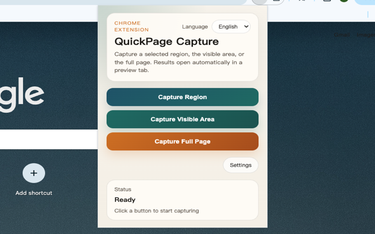
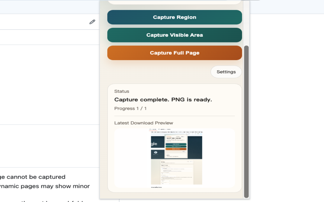
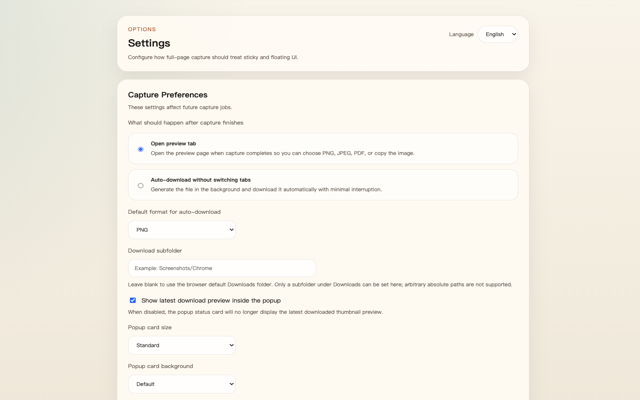

# QuickPage Capture

A `Manifest V3` Chrome extension for capturing web pages as images or PDF.

It supports region capture, visible-area capture, and full-page capture, with a built-in preview page for exporting results as `PNG`, `JPEG`, or `PDF`.

## Features

- Capture a selected region of the page
- Capture the current visible viewport
- Capture the full page by scrolling and stitching frames
- Preview results before exporting
- Export as `PNG`, `JPEG`, or `PDF`
- Copy image results directly to the clipboard
- Switch the UI between Chinese and English
- Configure full-page floating/sticky element handling
- Optionally auto-download without switching to the preview tab

## Screenshots

Example images under `docs/screenshots/`:

## Installation

### Load as an unpacked extension

1. Download the project​ and extract the folder
2. Open Chrome and go to `chrome://extensions/`
3. Turn on **Developer mode**
4. Click **Load unpacked**
5. Select this project folder

## Usage

1. Open a normal web page
2. Click the extension icon
3. Choose **Capture Region**, **Capture Visible Area**, or **Capture Full Page**
4. Wait for the preview page to open, or let the extension auto-download if that mode is enabled
5. Export the result as `PNG`, `JPEG`, or `PDF`, or copy it as an image

## Settings

The extension includes a settings page for capture behavior and export preferences.

- Open the extension popup and click **Settings**
- Choose whether results should open in the preview tab or auto-download in the background
- Set the default auto-download format to `PNG`, `JPEG`, or `PDF`
- Optionally save files into a subfolder under Chrome's default Downloads directory
- Show or hide the latest download preview thumbnail in the popup
- Choose how full-page capture handles floating or sticky UI
- Prefer clipboard copy for region capture before automatic download behavior

## Permissions

- `activeTab`: capture the currently active page after a user action
- `downloads`: save exported image and PDF files
- `clipboardWrite`: copy capture results to the clipboard
- `storage`: persist user preferences
- `tabs` and `scripting`: open extension pages and run capture logic
- `host_permissions` (`<all_urls>`): allow capture on supported web pages

## Privacy

- All capture processing happens locally in the browser
- This project does not upload screenshot data to any server

## Limitations

- Restricted pages such as `chrome://`, extension pages, and the new tab page cannot be captured
- Full-page capture works by scrolling and stitching frames, so some highly dynamic pages may show minor seams
- Chrome extensions cannot write to arbitrary absolute paths; the configured save path must be a subfolder under the default Downloads directory
- For `file://` pages, enable **Allow access to file URLs** in the extension details page

## Open Source

This project is suitable for publishing on GitHub as an open-source Chrome extension.

Before publishing, make sure your screenshots and example pages do not contain sensitive or private information.

## License

Licensed under `Apache-2.0`. See `LICENSE`.
